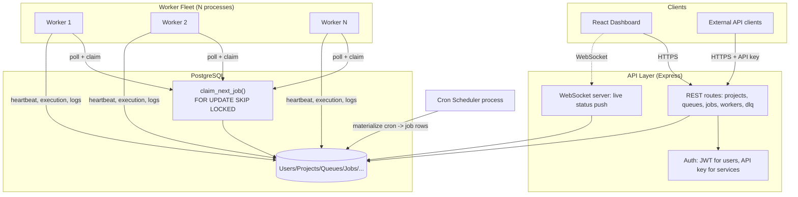
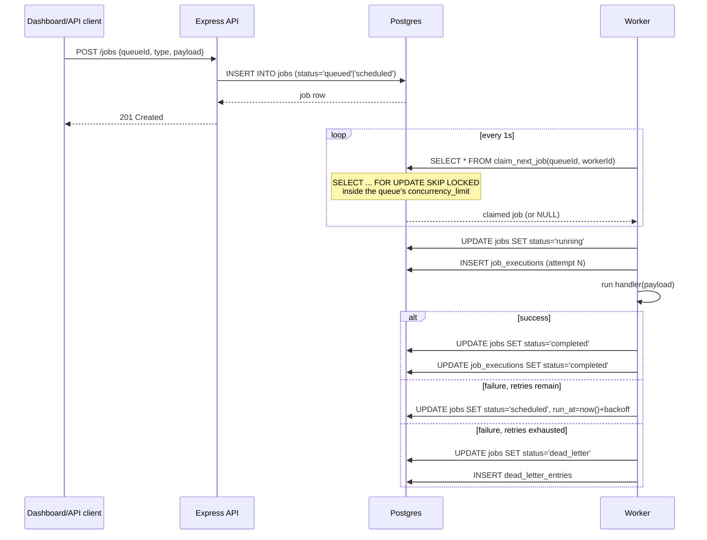

# Architecture

## System overview

## Request flow: submitting and running a job

## Why this shape

**Postgres as the single source of truth, not a separate broker.** Redis/RabbitMQ
would add an extra moving part and an extra failure mode (broker/DB fall out
of sync). At the scale this assignment targets, Postgres's `SKIP LOCKED`
gives broker-grade claim semantics without a second system to operate,
back up, and reason about consistency for.

**Workers are dumb pollers, not smart schedulers.** All the interesting
decisions — what counts as "next", how to respect `concurrency_limit`, how to
avoid double-claims — live in one SQL function. Workers just call it. This
means the claiming logic is testable in isolation (see
`claim.integration.test.js`) instead of scattered across N worker processes.

**Cron materialization is a separate process from workers.** If it lived
inside each worker, scaling workers would multiply cron firings. Kept as one
singleton process that turns `scheduled_jobs` due entries into real `jobs`
rows; workers then treat them like any other job.

**WebSocket carries a status summary, not per-row diffs.** A fully granular
live feed (every job's every field change, pushed instantly) is real
engineering work — you'd want a proper change-data-capture pipeline to do it
without hammering Postgres. Given the time available, the dashboard instead
polls REST every few seconds *and* gets a WebSocket-pushed aggregate summary
for the "system pulse" view. This is called out explicitly rather than
quietly cutting a corner — see `docs/design-decisions.md`.
