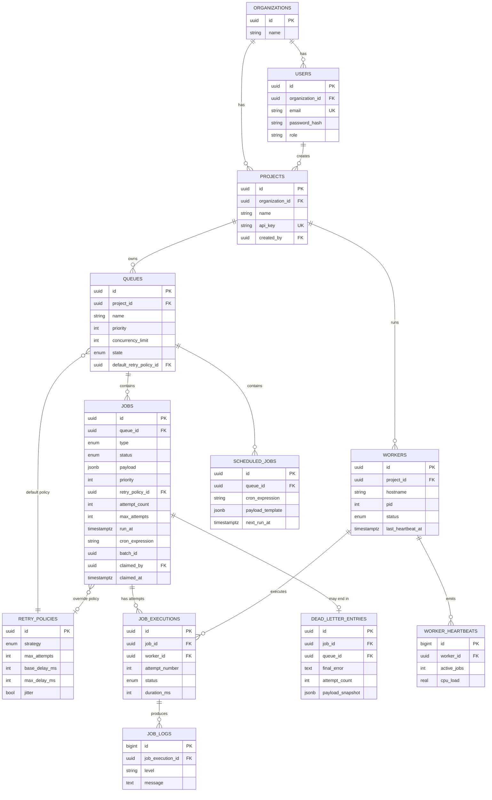

# Entity-Relationship Diagram

## Design notes

**Normalization.** Third normal form throughout — no repeating groups, no
derived columns stored redundantly, except two deliberate denormalizations:
- `jobs.max_attempts` copies the resolved value from the retry policy at
  creation time, so a later edit to a retry policy doesn't retroactively
  change how many attempts an in-flight job gets.
- `dead_letter_entries.payload_snapshot` duplicates the job's payload at the
  moment it died, so DLQ review doesn't depend on the (mutable) `jobs` row
  still existing in its original shape.

**Cascades.** `ON DELETE CASCADE` from organization → users/projects → queues
→ jobs → executions → logs. Deleting a project cleanly removes everything
under it; nothing is silently orphaned. `dead_letter_entries` also cascades
from `jobs`, so a hard-deleted job doesn't leave a dangling DLQ row.

**Indexes, and why each one exists:**
- `idx_jobs_claim_lookup` — partial index on `(queue_id, run_at) WHERE status
  IN ('queued','scheduled')`. This is the hot path: every worker poll hits
  it. Partial indexing keeps it small — completed/failed/dead-lettered jobs
  (the overwhelming majority over time) never bloat it.
- `idx_jobs_idempotency` — partial unique index on `(queue_id,
  idempotency_key) WHERE idempotency_key IS NOT NULL`. Enforces
  dedup only for jobs that opt in; doesn't force every job to have a key.
- `idx_heartbeats_worker_time` — `(worker_id, created_at DESC)`. Heartbeats
  are the highest-volume table; this index serves "most recent heartbeats
  for worker X" without a sort at query time.
- `idx_jobs_batch` — partial, `WHERE batch_id IS NOT NULL`, since most jobs
  aren't part of a batch.

**Why `job_executions` is separate from `jobs`.** A job can fail and retry
multiple times; each attempt needs its own start/end time, duration, and
error, without overwriting the previous attempt's record. Splitting this out
means `jobs` stays small (one row per logical job) while full attempt
history lives in a table designed for it — and `job_logs` hangs off
`job_executions` rather than `jobs` for the same reason: logs belong to one
attempt, not the job as a whole.
